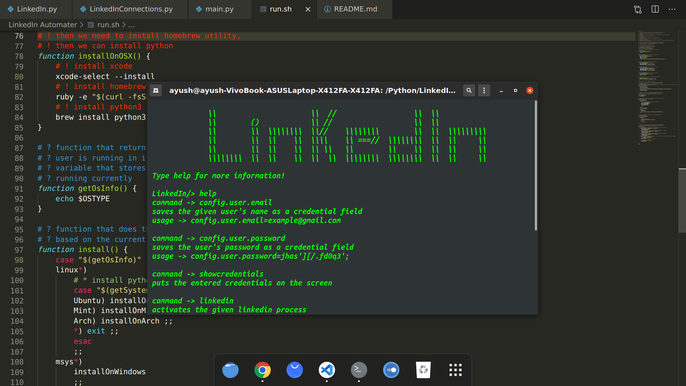

# Getting started with LinkedIn Automater

## Available Scripts

In the project directory, you can run:

### `./run.sh`

Runs the program

### `config.user.email=example@gmail.com`

Adds email to configurations

### `config.user.password=00000000`

Adds password to configurations

Once you are done adding configurations you can run the command

### `linkedin send`

It will start sending invitation